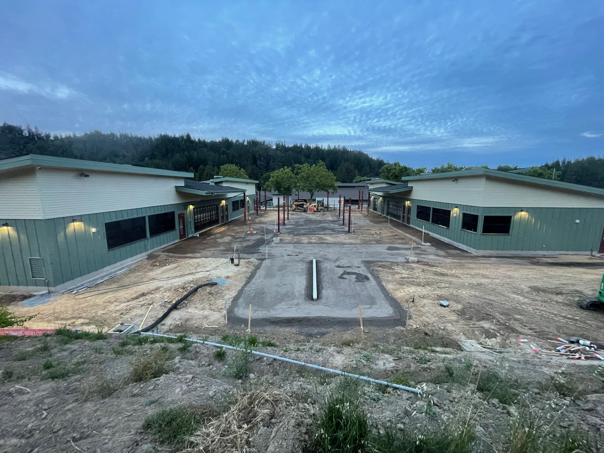

I'm Mr. Brown, an Engineer and Computer Scientist. If you are taking one of my classes this year, I look forward to getting to know you. The best way to connect with me is via my school email address, [ebrown@slvusd.org](mailto:ebrown@slvusd.org).

## Programs
### SLV High School

* ICT Essentials (co-teaching with Mr. Rollins) - 9th Grade / 3rd period
* Computer Science AP Principals - 2nd period
* Robotics - 5th period

### SLV Middle School

* 8th Grade Computer Science (1 semester) - 4th period
* [7th Grade Computer Science](cs7) (1 semester) - 6th period
* Underwater ROV Club (Tuesdays after school)

### SLV Elementary School

* 4th/5th Grade Coding Fridays (after school)

### Community

* Maker's Night / Coderdojo (3rd Tuesdays 6:30-8:30pm)

## New Computer Science Building

